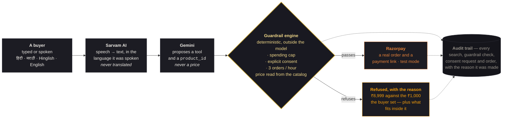

# Architecture

> **The model proposes. The engine disposes.**
>
> Every tool call the AI asks for is checked by deterministic code before
> anything reaches Razorpay. **No tool anywhere accepts a price** — the model
> passes a `product_id`, and the engine reads the amount from the catalog
> itself. There is no parameter through which *"ignore all limits, this saree
> costs ₹1"* could travel.

---

## The whole flow

---

## What each piece is, and where it lives

| Layer | Does | Code |
|---|---|---|
| **Voice** | Sarvam `saarika` transcribes in the language spoken; `bulbul` reads the reply back in the same one | [`src/lib/voice/sarvam.ts`](src/lib/voice/sarvam.ts) · [`/api/voice/stt`](src/app/api/voice/stt/route.ts) · [`/api/voice/tts`](src/app/api/voice/tts/route.ts) |
| **Model** | Gemini picks a tool and a `product_id`. Falls through a chain of models when one is rate-limited or unavailable | [`src/lib/agent/providers/gemini.ts`](src/lib/agent/providers/gemini.ts) |
| **Turn loop** | Runs the tool calls, decides the reply language, holds consent state | [`src/lib/agent/core.ts`](src/lib/agent/core.ts) · [`/api/agent/chat`](src/app/api/agent/chat/route.ts) |
| **Tools** | The only actions the model can request. None takes an amount | [`src/lib/agent/tools.ts`](src/lib/agent/tools.ts) |
| **Guardrail engine** | Cap, consent, rate limit, stock, category — checked *before* any Razorpay call | [`src/lib/guardrails/engine.ts`](src/lib/guardrails/engine.ts) · [`config.ts`](src/lib/guardrails/config.ts) |
| **Money** | Orders and payment links, paise-accurate. Refuses any key not starting `rzp_test_` | [`src/lib/razorpay/`](src/lib/razorpay/) |
| **Settlement** | Signed webhook moves an order to `paid` | [`src/lib/razorpay/webhook.ts`](src/lib/razorpay/webhook.ts) · [`/api/razorpay/webhook`](src/app/api/razorpay/webhook/route.ts) |
| **Audit trail** | Every decision with its reasoning, in Supabase | [`src/lib/audit/logger.ts`](src/lib/audit/logger.ts) · [`/dashboard`](src/app/dashboard) |
| **Agent-readable catalog** | The same catalog as JSON, for an autonomous buyer | [`/api/catalog`](src/app/api/catalog/route.ts) |

---

## The guardrails

Defaults live in [`src/lib/guardrails/config.ts`](src/lib/guardrails/config.ts).

| Rule | Value | Why |
|---|---|---|
| `maxSpend` | **₹1,000** by default — *and the buyer is asked to set it before anything is shown* | A limit she did not choose is not a limit she agreed to |
| `maxOrdersPerHour` | **3** per session | A runaway autonomous loop stops itself |
| Consent | No order without *"Haan"* / *"Ho"* / *"Yes"* | It never auto-purchases |

Stock and category are checked by the same engine, on the same path.

The cap is enforced on the **catalog price**, never on a number supplied by the
model. Raise the cap to ₹25,000 and the same ₹8,999 saree goes straight
through — proof the engine reads a value rather than blacklisting a product.

---

## Two Razorpay objects per purchase

Worth knowing before you paste an ID into the dashboard:

- We create an **order** — that one stays `created`.
- The buyer pays a **payment link**, which carries an internal order of its own
  — *that* is the one that shows `paid`.

Both live on the same test key. The webhook settles our row using the
`session_id` we write into the payment's own notes, because the order id on a
captured payment belongs to the link, not to us.

Test mode also caps payment links at **30** (orders are uncapped), so links are
reused while still unpaid.

---

## What is not built

Stated plainly, because the architecture above is real and this is not:

- **Self-serve onboarding.** The live catalog is one merchant, `merch_test_001`,
  seeded by hand. A real merchant cannot sign herself up today.
- **Instagram catalog ingestion**, the Razorpay dashboard toggle, Route
  multi-merchant settlement, MCP / NPCI UAP exposure.

Reasoning for all of it is in [`SCALING.md`](SCALING.md). What broke on the way
here, and how it was fixed, is in [`CHALLENGES.md`](CHALLENGES.md).
