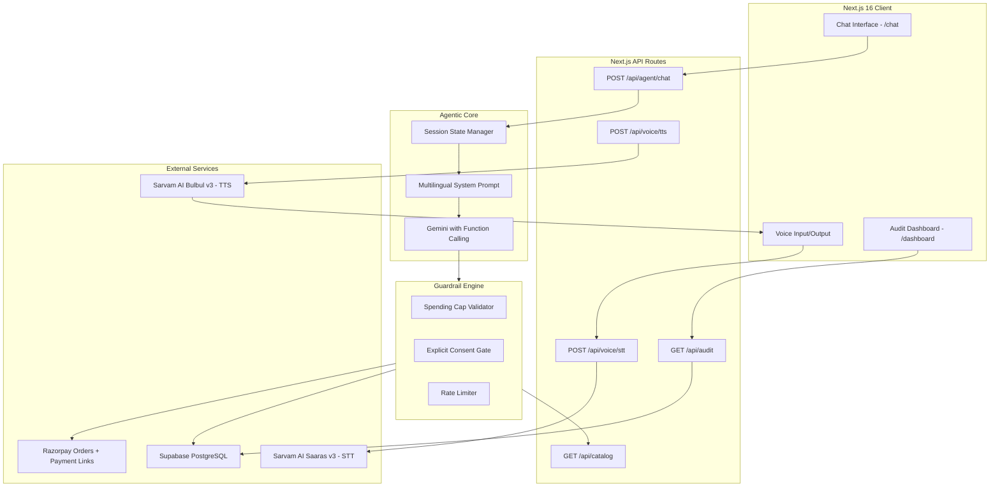

# 🛍️ AgentPay India — Agentic Commerce Gateway for Bharat Merchants

<div align="center">

[](https://razorpay.com/buildathon/)
[](https://razorpay.com/docs/api/)
[](https://nextjs.org/)
[](https://www.typescriptlang.org/)
[](https://www.sarvam.ai/)
[](https://ai.google.dev/)
[](https://supabase.com/)
[](LICENSE)

<br />

**Making 60 Million Bharat Merchants AI-Transactable — in Hindi, Marathi, Hinglish & Voice**

[🚀 Live Demo](https://agentpay-india.vercel.app) · [📹 Video Pitch](#) · [🏗️ Architecture](#-system-architecture) · [🛡️ Guardrails](#-deterministic-guardrails-first-engine) · [📊 Audit Trail](#-immutable-audit-trail--observability)

</div>

---

## The Problem

India has **60 million+ small merchants**. Zomato, Swiggy, Zepto are already AI-transactable. But the neighborhood saree seller? The handloom artisan? Still stuck in manual WhatsApp DMs.

> A Pune saree boutique posts an Instagram Reel → it goes viral → **200+ DMs flood in** → she can reply to 30 → **70% of high-intent buyers drop off** → revenue lost forever.

**AgentPay India** fixes this. One integration turns any merchant's catalog into an **AI-transactable, voice-enabled, guardrailed commerce endpoint** — reachable by human buyers in their native language *and* autonomous AI agents.

### How It Works

```
 ┌─────────────┐     ┌──────────────────┐     ┌─────────────────┐     ┌──────────────────┐
 │  👤 Buyer    │     │  🧠 AI Agent     │     │  🛡️ Guardrails  │     │  💳 Razorpay     │
 │  speaks in   │ ──→ │  understands     │ ──→ │  checks budget  │ ──→ │  creates real    │
 │  Hindi /     │     │  intent, finds   │     │  + gets consent │     │  order + payment │
 │  Marathi /   │     │  products from   │     │  before any     │     │  link            │
 │  Hinglish    │     │  catalog         │     │  payment        │     │                  │
 └─────────────┘     └──────────────────┘     └─────────────────┘     └──────────────────┘
```

*The Pitch: "Razorpay made Zomato AI-transactable. We make the neighborhood saree store AI-transactable."*

---

## 🏪 Featured Merchant: Sakhi Sarees, Pune

| | |
|---|---|
| **Who** | Pune-based saree boutique run by a woman entrepreneur |
| **What she sells** | Authentic Paithani sarees from Yeola/Paithan weavers + handloom cottons (₹499 – ₹25,000) |
| **How she sells** | Instagram Reels (saree draping videos), Facebook Ads, WhatsApp DMs |
| **The friction** | Viral Reel → 200+ DMs → can reply to 30–40 → **loses 70% revenue** |
| **With AgentPay** | AI handles all 200 DMs, 24/7, in Hindi/Marathi/Hinglish — with real Razorpay checkout |

---

## ✨ Key Features

### 🗣️ Native Multilingual & Voice Commerce
- Chat in **Hindi, Marathi, Hinglish, or English** — the agent responds in the same language
- **Voice-in / Voice-out** via Sarvam AI — Saaras v3 (STT) + Bulbul v3 (TTS)
- Authentic Maharashtrian textile vocabulary: *पैठणी, हातमाग, जरी, पदर, आंबा मोटिफ*

### 💳 Real Razorpay Integration (Not Mocks)
- Direct `orders.create()` and `paymentLink.create()` via Razorpay Node.js SDK
- Real test-mode order IDs (`order_PthN4kSaR1`) and clickable payment links (`https://rzp.io/i/...`)
- Paise-accurate subunit handling (₹599 → 59900 paise)

### 🛡️ Deterministic Guardrails-First Engine
- **Spending caps**: ₹1,000 default limit blocks ₹8,999 Paithani silk → suggests affordable alternatives
- **Explicit consent**: No order without *"Haan"* / *"Ho"* / *"Yes"* — never auto-purchases
- **Rate limiting**: Max 3 orders/hour prevents runaway autonomous loops
- Guardrails are **architecture, not a prompt suggestion** — enforced outside the LLM

### 📊 Immutable Audit Trail & Observability
- Every search, LLM reasoning step, guardrail decision, and payment creation logged to Supabase
- Color-coded timeline on `/dashboard` — green (passed), red (blocked), yellow (awaiting consent)
- Expandable entries showing full input/output JSON + agent reasoning

---

## 💬 Demo Flows

### Flow 1: Happy Path — Hinglish → Real Razorpay Order

```
[User]    "1000 ke under cotton saree dikhao"
[Agent]   "Yeh rahi 3 beautiful cotton sarees ₹1,000 ke under! 🪷"
           ├── Handloom Cotton Saree — Mango Motif (₹599) [हातमाग कॉटन साडी]
           ├── Chanderi Cotton Silk — Peacock Border (₹799)
           └── Khadi Cotton Saree — Block Print (₹499)

[User]    "Pehli wali mango motif chahiye"
[Agent]   "₹599, Free Size. Order confirm karu?" → [Haan ✓] [Nahi ✗]

[User]    Clicks [Haan ✓]
[Agent]   ✅ "Order confirmed!"
           ├── Razorpay Order ID: order_PthN4kSaR1
           ├── Amount: ₹599
           └── [Pay Now →] opens https://rzp.io/i/... payment link
```

### Flow 2: Guardrail Block — Budget Protection

```
[User]    "Authentic Paithani silk saree dikhao"
[Agent]   ⚠️ BLOCKED
           "Aapki spending limit ₹1,000 hai. Pure Silk Paithani ₹8,999 se shuru hoti hain."
           💡 "₹1,000 ke under Paithani-print cotton sarees dekhein?"
           [Attempted: ₹8,999 | Limit: ₹1,000 | Status: Blocked & Logged]
```

---

## 🏗️ System Architecture



---

## 📂 Project Structure

```
agentpay-india/
├── public/                          # Static assets
├── src/
│   ├── app/
│   │   ├── layout.tsx               # Root layout, Google Fonts (Devanagari), theme
│   │   ├── page.tsx                 # Landing page with merchant story
│   │   ├── globals.css              # Full CSS design system (no Tailwind)
│   │   ├── chat/page.tsx            # Full-screen conversational commerce UI
│   │   ├── dashboard/page.tsx       # Real-time audit trail viewer
│   │   └── api/
│   │       ├── agent/chat/route.ts  # Agent reasoning + tool calling
│   │       ├── voice/stt/route.ts   # Sarvam AI speech-to-text
│   │       ├── voice/tts/route.ts   # Sarvam AI text-to-speech
│   │       ├── catalog/route.ts     # Product search & filtering
│   │       └── audit/route.ts       # Audit log retrieval
│   ├── components/
│   │   ├── chat/                    # ChatContainer, MessageBubble, ProductCard,
│   │   │                            # ConsentPrompt, GuardrailAlert, OrderConfirmation
│   │   ├── voice/                   # VoiceButton, AudioPlayer
│   │   ├── dashboard/               # AuditTrailViewer, AuditEntry
│   │   └── ui/                      # Button, Card, Badge, Modal primitives
│   ├── lib/
│   │   ├── agent/                   # Agent loop, tools, prompt, providers
│   │   ├── razorpay/                # SDK client, orders.create, paymentLink.create
│   │   ├── guardrails/              # Spending cap engine, consent rules, rate limits
│   │   ├── voice/                   # Sarvam REST client (Saaras + Bulbul)
│   │   ├── catalog/                 # 16 saree products (3 price tiers) + search
│   │   ├── audit/                   # Structured decision logger
│   │   └── db/                      # Supabase client
│   └── types/index.ts               # Shared TypeScript interfaces
├── supabase/schema.sql              # Database schema
├── docs/
│   ├── ARCHITECTURE.md              # Detailed system design
│   └── CHALLENGES.md                # Engineering challenges & resolutions
└── README.md
```

---

## 🚀 Getting Started

### Prerequisites

- **Node.js** v20.9.0+ (required by Next.js 16)
- **npm**
- API keys for: Razorpay (test mode), Google Gemini, Sarvam AI, Supabase

### Setup

```bash
git clone https://github.com/rajdeepchatale/agentpay-india.git
cd agentpay-india
npm install
```

Create `.env.local`:

```env
# Gemini (Agent Brain) — free tier at aistudio.google.com
GEMINI_API_KEY=xxxxxxxxxxxxxxxxxxxxxxxx
AGENT_PROVIDER=gemini
GEMINI_MODEL=gemini-flash-lite-latest

# Razorpay (Test Mode)
RAZORPAY_KEY_ID=rzp_test_xxxxxxxxxxxxxxxx
RAZORPAY_KEY_SECRET=xxxxxxxxxxxxxxxxxxxxxxxx

# Sarvam AI (Voice — 22 Indian Languages)
SARVAM_API_KEY=xxxxxxxxxxxxxxxxxxxxxxxx

# Supabase (Audit & Orders)
NEXT_PUBLIC_SUPABASE_URL=https://xxxxxxxx.supabase.co
NEXT_PUBLIC_SUPABASE_ANON_KEY=xxxxxxxxxxxxxxxxxxxxxxxx
SUPABASE_SERVICE_KEY=xxxxxxxxxxxxxxxxxxxxxxxx
```

Initialize the database by running `supabase/schema.sql` in Supabase SQL Editor.

```bash
npm run dev
```

| Page | URL |
|------|-----|
| Landing | [localhost:3000](http://localhost:3000) |
| Chat & Voice | [localhost:3000/chat](http://localhost:3000/chat) |
| Audit Dashboard | [localhost:3000/dashboard](http://localhost:3000/dashboard) |

---

## 📡 API Reference

### `POST /api/agent/chat`

```jsonc
// Request
{
  "message": "1000 ke under cotton saree dikhao",
  "session_id": "c39a8385-8a8b-4b14-87cf-1b8f047e1234",
  "guardrails": { "max_spend": 1000 }
}

// Response — type determines UI rendering
{
  "type": "products",                    // text | products | order_created | guardrail_blocked | consent_required | failure_handled | error
  "content": "Yeh rahi 3 cotton sarees ₹1,000 ke under! 🪷",
  "data": {
    "products": [{
      "id": "prod_001",
      "name": "Handloom Cotton Saree — Mango Motif",
      "name_hindi": "हातमाग कॉटन साडी — आंबा मोटिफ",
      "price": 599,
      "in_stock": true
    }]
  },
  "language": "hinglish",
  "audit_id": "aud_98f4a1c0"
}
```

### `POST /api/voice/stt`
`multipart/form-data` with audio blob → `{ text, language, confidence }`

### `POST /api/voice/tts`
`{ text, language }` → `audio/wav` binary stream

### `GET /api/audit?session_id=xxx`
Returns color-coded decision timeline with reasoning

### `GET /api/catalog?q=saree&max_price=1000&category=sarees`
Returns `{ products: Product[] }`

---

## 🔧 Engineering Challenges

> Full deep-dive in [`docs/CHALLENGES.md`](docs/CHALLENGES.md)

| Challenge | What Went Wrong | How We Fixed It |
|-----------|----------------|-----------------|
| **Indian code-mixing** | Users mix Hindi/Marathi/English mid-sentence (*"Yeola Paithani madhye green ahe ka?"*) — LLMs reply in rigid formal Hindi | Domain-specific saree lexicon in system prompt + Sarvam `saaras:v3` auto-detection (`hi-IN`, `mr-IN`, `en-IN`) |
| **LLM financial safety** | An LLM can hallucinate discounts or skip consent | Out-of-band Guardrail Engine — tool execution is policy-checked *outside* the LLM before any Razorpay call |
| **Razorpay paise trap** | ₹599 passed as `599` instead of `59900` → 100x underpayment | Strict `Math.round(price * 100)` transformation layer with runtime assertions |
| **Sarvam TTS response format** | Returns base64-encoded audio in JSON `{ audios: ["..."] }`, not a binary stream | Server-side Buffer decode + binary streaming to browser |

---

## 🔮 Future Roadmap

> Full architecture in [`docs/SCALING.md`](docs/SCALING.md) — how one merchant
> becomes sixty million, and why guardrails-as-architecture is what lets a
> regulated payments company ship agentic commerce at all.

1. **NPCI Unified Agentic Protocol (UAP)** — Universal AI buyer protocol when NPCI agentic standards launch
2. **Razorpay MCP Server** — Expose merchant catalogs directly to external agent runtimes (Claude, ChatGPT, Gemini)
3. **WhatsApp Business Webhook** — Deploy agent directly into merchant's WhatsApp so viral Instagram DMs convert instantly

---

## 👨‍💻 Built By

**Rajdeep Chatale** · Track 01 — AI Growth & Agentic Commerce · [Razorpay AI Buildathon 2026](https://razorpay.com/buildathon/)

---

<div align="center">
  <sub>Built with ❤️ for Bharat's 60 million small merchants.</sub>
</div>
