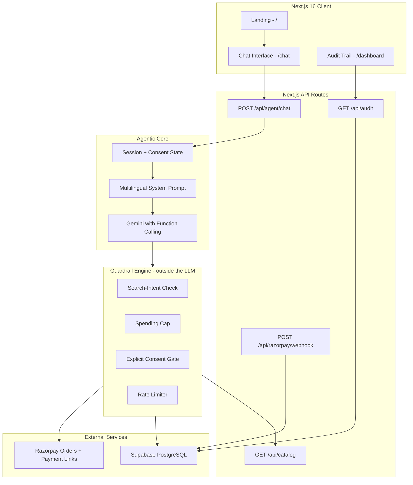

# 🛍️ AgentPay India — Agentic Commerce Gateway for Bharat Merchants

<div align="center">

[](https://razorpay.com/buildathon/)
[](https://razorpay.com/docs/api/)
[](https://nextjs.org/)
[](https://www.typescriptlang.org/)
[](https://ai.google.dev/)
[](https://www.sarvam.ai/)
[](https://supabase.com/)
[](LICENSE)

<br />

**Making 60 Million Bharat Merchants AI-Transactable — in Hindi, Marathi, Hinglish & English**

[✨ What it does](#what-it-does) · [🏗️ Architecture](#-system-architecture) · [🛡️ Guardrails](#-deterministic-guardrails-first-engine) · [📊 Audit Trail](#-immutable-audit-trail) · [🐛 What broke, and how](docs/CHALLENGES.md)

</div>

---

## The Problem

India has **60 million+ small merchants**. Zomato, Swiggy, Zepto are already AI-transactable. But the neighborhood saree seller? The handloom artisan? Still stuck in manual WhatsApp DMs.

> A Pune saree boutique posts an Instagram Reel → it goes viral → **200+ DMs flood in** → she can reply to 30 → **most high-intent buyers drop off** → revenue lost forever.

**AgentPay India** turns a merchant's catalog into an AI-transactable, guardrailed commerce endpoint — reachable by human buyers in their native language *and* by autonomous AI agents.

### How It Works

```
 ┌──────────────┐   ┌──────────────┐   ┌──────────────┐   ┌──────────────┐   ┌──────────────┐
 │ 🛍️ The shop   │   │ 👤 Buyer      │   │ 🧠 Agent      │   │ 🛡️ Guardrail  │   │ 💳 Razorpay   │
 │ asks first:  │──→│ names her    │──→│ finds sarees │──→│ engine holds │──→│ real order + │
 │ "aapka       │   │ figure, and  │   │ from the     │   │ HER number,  │   │ payment link │
 │  budget      │   │ speaks or    │   │ catalog —    │   │ in code,     │   │ inside the   │
 │  kitna hai?" │   │ types freely │   │ never invents│   │ outside the  │   │ conversation │
 │              │   │              │   │ one          │   │ model        │   │              │
 └──────────────┘   └──────────────┘   └──────────────┘   └──────────────┘   └──────────────┘
```

**The limit is the buyer's, not ours.** The shop asks what the buyer wants to spend
before showing anything. That one question is the difference between a demo and an agent:
a cap we chose makes a later refusal *our rule imposed on a stranger*, while a figure the
buyer named makes the identical refusal **the agent keeping her word**.

*The pitch: "An AI shopkeeper for the 60 million merchants who don't have an app."*

The agent answers every DM in the buyer's own language, takes the payment inside the conversation, and holds a spending limit nobody can talk her out of.

---

## What it does

| | Where |
|---|---|
| Multilingual chat agent — Hindi, Marathi, Hinglish, English | `/chat` |
| Deterministic guardrail engine, outside the LLM | `src/lib/guardrails/` |
| Real Razorpay test-mode orders and payment links | `src/lib/razorpay/` |
| Voice in and out — the agent listens, and answers aloud unprompted | Sarvam saarika + bulbul |
| Language picker — pin one, and the whole shop speaks it | header |
| Supabase audit trail, with the reasoning behind each decision | `/dashboard?session_id=…` |
| Signed payment webhook, settled by the session in the payment's own notes | `/api/razorpay/webhook` |
| 16-saree catalog with a machine-readable search API | `/api/catalog` |
| Landing page and design-system specimen sheet | `/` · `/design` |

### Scored against the track's bar

Track 01 states the bar outright: *"Every money action explainable, bounded and
gated. Show the audit trail and one failure handled gracefully."* Each row below
names where that lives, so it can be checked rather than taken on trust.

| The bar | Where it lives |
|---|---|
| Every money action **explainable** | Every search, block, consent request and order is logged with the reasoning behind it — `src/lib/audit/logger.ts` |
| **bounded** | `src/lib/guardrails/` — spending cap, 3 orders per session per hour, category allow-list, and a ₹1,00,000 ceiling a tampered request cannot raise |
| **gated** | No order without the buyer's own words, judged server-side. The model never asserts consent, and neither does the client — `src/lib/agent/conversation.ts` |
| **Show the audit trail** | `/dashboard?session_id=…`, grouped into turns, each entry expandable to its exact input/output JSON |
| **one failure handled gracefully** | Ask for the Nauvari Saree — it is out of stock. The agent says so plainly and offers three in-stock alternatives instead of failing: `type: "failure_handled"`, `recovery_action: "Offered 3 in-stock alternative(s)."` |

**Razorpay runs in test mode.** `src/lib/razorpay/client.ts` refuses to start with any key that does not begin with `rzp_test_`. No real money moves.

**"Sakhi Sarees" is a representative demo merchant, not a real client.** There are no real customers, revenue figures, order volumes, or testimonials anywhere in this project, and none should be inferred.

---

## 🏪 Demo Merchant: Sakhi Sarees, Pune

A representative boutique, written to be realistic — not an existing customer.

| | |
|---|---|
| **Who** | Pune saree boutique run by a woman entrepreneur |
| **What she sells** | Paithani sarees from Yeola/Paithan weavers + handloom cottons (₹499 – ₹78,000) |
| **How she sells** | Instagram Reels, WhatsApp DMs |
| **The friction** | Viral Reel → 200+ DMs → she can answer 30–40 |
| **With AgentPay** | The agent answers all of them, 24/7, in Hindi/Marathi/Hinglish — with real Razorpay checkout inside the conversation |

---

## 🤔 "Why not just build them a website?"

Take our demo merchant — she runs Sakhi Sarees, and she is one of the 60 million,
not the shape of all of them. She could build a site. Plenty of merchants have.
Here is what happens anyway.

Her Reel goes out at 9pm. By midnight there are **200 DMs**:

> *"kitna hai?"* · *"green mein hai?"* · *"shaadi ke liye theek rahega?"* ·
> *"aur photo bhejo"*

A product page answers none of those. They are addressed to **her**. So she
replies to 30 of them the next morning, and the rest have already bought
somewhere else.

**The website did not fail. It was never in the conversation.**

And when she does send a link, look at what she is asking a buyer to do:

```
Reel  →  bio link  →  site  →  find the saree  →  checkout  →  pay
```

Six steps, each one shedding people, for a buyer who was ready at step zero.
The agent removes the handoff entirely — she never leaves the chat she was
already in.

Then there is who her buyers actually are. A checkout form assumes English, a
keyboard, and comfort with a payment flow. Her buyers type romanised Hinglish
because typing Devanagari on a phone is slow — or would simply rather speak.
**Voice and native language are not polish here. They are how those buyers get
in at all.**

### Razorpay already answered this question

Every merchant in Razorpay's 2026 agentic pilots — **Zomato, PVR INOX,
Vodafone Idea, Bluestone, Honasa** — already had an app. Vodafone Idea had a
working recharge page.

Razorpay built conversational checkout into them anyway: the in-app agent
recognised the user's usual plan, recommended it, and took the payment inside
the chat. If a storefront were the answer, those pilots would not exist. Their
own brief names the direction — *"Conversational in-app checkout."*

The difference here is who it reaches. **Every one of those pilot partners is
an enterprise with an app. The saree shop has no app.** That is the long tail
those pilots structurally cannot reach.

### "So how does she get this, if she has no website?"

**She doesn't build anything. She gets a link.**

Razorpay already ships this distribution model. A **Payment Link** is created
in the dashboard and pasted into WhatsApp; a **Payment Page** is a hosted,
no-code storefront. Neither requires her to own a website, hire a developer, or
deploy anything.

**AgentPay is shaped like a Payment Page that talks back.** She gets a URL and
pastes it in her bio — no site, no app, nothing deployed. That *shape* is what
this demo proves: `/chat` is a link, and a link is all she would ever need to
hand a buyer.

Being precise about what that does and does not mean: a Payment Page is
something a merchant creates herself, from a dashboard Razorpay hosts. This is
one merchant's shop, hosted here, with a seeded catalog. **The distribution
model is the argument; the dashboard and the self-serve creation are argued in
[`docs/SCALING.md`](docs/SCALING.md), not built.**

The one thing she supplies is her catalog. Reading it out of her Instagram
captions or her WhatsApp price list is **argued in
[`docs/SCALING.md`](docs/SCALING.md), not built** — for this demo the catalog is
seeded. And the end state needs no link at all: the agent runs inside her
existing WhatsApp number, where the DMs already arrive.

### What this does not claim

**AgentPay does not replace her storefront. It replaces the 200 unanswered
DMs.**

If she has a website, keep it. It still will not answer *"kitna hai?"* at 11pm
in Marathi. She does — for 30 of them, hours late. That gap is the whole
product.

---

## ✨ Key Features

### 🗣️ Native Multilingual Commerce
- Chat in **Hindi, Marathi, Hinglish, or English** — the agent replies in the same language
- **Or pin one.** A picker in the header fixes the language for every turn. Detection is a
  good default, but it reads the message in front of it — and `"ok"` or `"haan"` carries no
  marker at all, so a Marathi conversation could slip into Hindi on the exact turn that
  confirms a purchase. A choice outranks detection in the prompt, in the reply, and as a
  hint to the transcriber
- **Speak instead of typing** — Sarvam AI transcribes her speech and reads the reply back
  in the language she used. Typing Devanagari on a phone is slow enough that most buyers
  give up and type romanised Hinglish; speaking removes that tax
- **She talks first.** The shop greets on the buyer's first gesture and speaks every reply
  after it — no speaker icon to hunt for. Browsers refuse audio before a gesture, so that
  is the earliest honest moment; a greeting on page load plays to nobody. Sending a message
  or opening the mic silences her mid-sentence, because talking over a customer is the one
  thing a shopkeeper never does
- **She announces, she does not narrate.** Sarvam's TTS latency scales with input length —
  measured live: 48 chars 1.0s, 133 chars 2.8s, 267 chars 4.8s. Reading a whole reply aloud
  lands the voice seconds after text the buyer has already finished. So she says
  *"ये रहीं 7 साड़ियाँ। देखिए, कौन सी पसंद आई?"* and leaves the detail on screen
- Authentic Maharashtrian textile vocabulary: *पैठणी, हातमाग, जरी, पदर, आंबा मोटिफ*
- Devanagari is first-class: script detection is Unicode-aware, not ASCII `\b`

### 💳 Real Razorpay Integration (Not Mocks)
- Direct `orders.create()` and `paymentLink.create()` via the Razorpay Node SDK
- Real test-mode order IDs (`order_TXB1BtoaX8629G`) and clickable `rzp.io` payment links
- **Two Razorpay objects per purchase, and it matters.** We create an order; the buyer pays
  a *payment link*, which carries an internal order of its own. So the id above stays
  `created` forever and `order_TXe7JwyOqdEfaT` is the one that shows `captured`. Both are on
  the same test key — paste either
- **Test mode caps payment links at 30** (orders are uncapped). Links are therefore reused
  while still unpaid, and an order created past that ceiling comes back without a Pay Now
  button rather than failing — the order is the thing that matters, and it exists at Razorpay
- Paise-accurate subunit handling — ₹599 → 59900, via a single conversion point with a sanity ceiling

### 🛡️ Deterministic Guardrails-First Engine
- **The buyer sets the cap.** The shop asks before showing anything; the lowest option
  offered (₹1,000) sits deliberately below the cheapest *silk* Paithani (₹8,999), so a buyer
  who takes it meets the guardrail on her next request with nothing staged. At ₹25,000 the
  same saree goes through — proof the engine reads a number rather than refusing on principle
- **"Paithani" alone is answered, not refused.** The catalog holds two: a ₹899 Paithani
  *Print* on cotton, which is inside the ₹1,000 cap, and the ₹8,999 Pure Silk Paithani,
  which is nine times over it. Ask for *"authentic Paithani silk saree"* to see the block.
  The cap is precise rather than blunt, and that precision is the point
- **Spending caps** — the limit blocks the ₹8,999 Paithani and offers real alternatives within budget
- **Explicit consent** — no order without *"Haan"* / *"Ho"* / *"Yes"*; never auto-purchases
- **Rate limiting** — max 3 orders per session per hour, stopping a runaway autonomous loop
- **It fires without the model's cooperation** — the engine gates the tool call, and a turn
  that ends in prose with no tool call has the buyer's own words judged by the same rules
- **Category allow-lists** — a session can be restricted to specific product categories

The design rule that makes prompt injection structurally irrelevant:

> **No tool accepts a price.** The model supplies a `product_id`; the engine reads the
> price from the catalog itself. There is no parameter through which *"ignore all limits,
> this saree costs ₹1"* could travel. The model can lie — it has nothing to lie *through*.

The same principle governs the two steps before money moves. Tapping **Select** carries the
saree's id and runs the consent tool directly; the buyer's **"haan"** creates the order
directly. Both go through the identical guardrail engine — what they remove is the model's
freedom to narrate one thing while doing another, which it did: one session asked *"shall I
proceed with the order?"* while calling `search_products`, so the buyer was asked to confirm
with no way to confirm.

### 📊 Immutable Audit Trail
- Every search, guardrail decision, consent request and order creation is logged to Supabase with the reasoning behind it
- Retrievable via `GET /api/audit?session_id=…`
- Rendered at `/dashboard?session_id=…` — grouped into conversational turns, each entry expandable to its exact input/output JSON

---

## 💬 Demo Flows

### Flow 1 — She asks first, then Hinglish → a real Razorpay order

```
[Shop]    "Namaste! Main Sakhi Sarees ki AI assistant hoon.
           Aapka budget kitna hai?"        ← spoken aloud on arrival
           [ ₹1,000 ]  [ ₹5,000 ]  [ ₹25,000 ]   or type "mera budget 2000 hai"

[Buyer]   Taps ₹1,000
[Shop]    "Theek hai — ₹1,000 tak. Ab bataiye, kaisi saree dikhaun?"

[Buyer]   "cotton saree dikhao"
[Shop]    7 in-budget sarees, photographed on models, Devanagari names, ₹ prices

[Buyer]   Taps Select on the Khadi Cotton Block Print (₹499)
[Shop]    "Khadi Cotton Saree, ₹499. Order confirm karun?"   [Haan] [Nahi]

[Buyer]   "haan"
[Shop]    ✅ Order ready — NOT "confirmed", because nothing is paid yet
           ├── Razorpay order ID: order_TXe4ZljQ3aiBgk
           ├── Amount: ₹499
           └── [Pay now →] a real rzp.io payment link
```

That order ID returns HTTP 200 from Razorpay's API. Every ID in this README does.

**Select and "haan" are deterministic.** The tap carries the saree's id and the server runs
the consent tool directly; her agreement creates the order directly. The model writes
prose — it does not decide whether the last two steps before money happen.

---

### Flow 2 — The guardrail, holding the number she chose

```
[Buyer]   "Authentic Paithani silk saree"        (her limit: ₹1,000)

[Shop]    ⚠️  Over your limit — Pure Silk Paithani
           ₹1,000 your limit ───┃▓▓▓▓▓▓▓▓▓▓▓▓▓▓▓  ₹8,999  · 9× over
           Within ₹1,000:
             Handloom Cotton Saree      ₹599
             Chanderi Cotton Silk       ₹799
             Paithani Print Saree       ₹899
```

Rendered as a *kaath* — the reinforced woven selvedge that stops a saree unravelling,
which is precisely what a spending guardrail does.

**The rule fires even when the model does not reach for a tool.** A guardrail that only
runs at the tool boundary misses every turn where the model simply *talks about* a saree
it cannot sell — so a turn that ends in prose has the buyer's own words judged by the same
engine. Whether the limit applies never depends on how the model felt like replying.

---

### Flow 3 — The close, in her voice

```
[Buyer]   pays on Razorpay

[Shop]    "Payment mil gaya — dhanyavaad! Aapka Khadi Cotton Saree ka order
           ₹499 mein confirm ho gaya hai. Sakhi Sarees se delivery ka update
           jald hi milega. Phir aaiye — nayi sarees aati rehti hain!
           Aapka experience kaisa raha?"        ← spoken, not printed

           [ Bahut acchha ]  [ Theek ]  [ Behtar ho sakta hai ]
                     ↓
           logged into the SAME audit trail as the guardrail decisions
```

**She notices the payment rather than waiting to be sent back.** Razorpay does not reliably
return the buyer to the shop, so the conversation polls for the webhook's verdict and
closes on that. She thanks the buyer because the money arrived — not because a redirect
worked.

---

## 🏗️ System Architecture



---

## 📂 Project Structure

```
agentpay-india/
├── public/products/                 # 16 saree photographs, on models
├── src/
│   ├── app/
│   │   ├── layout.tsx               # Root layout, Devanagari fonts, metadata
│   │   ├── page.tsx                 # Landing page — the merchant story + live replay
│   │   ├── globals.css              # Full CSS design system (no Tailwind)
│   │   ├── chat/page.tsx            # Full-screen conversational commerce UI
│   │   ├── design/page.tsx          # Design-system specimen sheet
│   │   ├── dashboard/page.tsx       # Audit trail viewer
│   │   └── api/
│   │       ├── agent/chat/route.ts  # Agent reasoning + tool calling
│   │       ├── voice/stt/route.ts   # Sarvam Saarika — speech in, language preserved
│   │       ├── voice/tts/route.ts   # Sarvam Bulbul — the reply, spoken
│   │       ├── catalog/route.ts     # Product search & filtering
│   │       ├── orders/status/route.ts  # Has this session paid yet? (polled after an order)
│   │       ├── feedback/route.ts    # Post-purchase rating → the same audit trail
│   │       ├── razorpay/webhook/route.ts  # Signed; created → paid
│   │       └── audit/route.ts       # Audit log retrieval
│   ├── components/
│   │   ├── chat/                    # ChatContainer, ChatInput, MessageBubble, ProductCard,
│   │   │                            # BudgetPrompt, DemoTour, LanguagePicker,
│   │   │                            # VoiceButton, SpeakButton, GuardrailRail,
│   │   │                            # ConsentPrompt, GuardrailAlert, OrderConfirmation,
│   │   │                            # FeedbackPrompt, FailureCard, ErrorCard,
│   │   │                            # TypingIndicator, SettingsModal
│   │   └── ui/                      # Button, Card, Badge, Input, Modal, Icon
│   ├── lib/
│   │   ├── agent/                   # Agent loop, tools, prompt, provider abstraction
│   │   ├── guardrails/              # Spending cap engine, consent, rate limits
│   │   ├── razorpay/                # SDK client, orders, payment links, paise maths
│   │   ├── chat/                    # State machine, session, and the copy the shop
│   │   │                            # speaks: opening (budget), confirm, closing,
│   │   │                            # ui-text (one table per language), language
│   │   │                            # precedence, useAgentVoice
│   │   ├── voice/                   # Sarvam client — saarika STT, bulbul TTS
│   │   ├── catalog/                 # 16 saree products (3 price tiers) + search + names
│   │   ├── audit/                   # Structured decision logger
│   │   └── db/                      # Supabase client
│   └── types/index.ts               # Shared TypeScript interfaces
├── supabase/schema.sql              # Database schema
├── docs/
│   ├── CHALLENGES.md                # Engineering challenges & resolutions
│   └── SCALING.md                   # One merchant → sixty million
└── DESIGN.md                        # The design system, as built
```

---

## 🚀 Getting Started

### Prerequisites

- **Node.js** v20.9.0+ (required by Next.js 16)
- API keys for: Razorpay (test mode), Google Gemini, Supabase

### Setup

```bash
git clone https://github.com/rajdeepchatale/agentpay-india.git
cd agentpay-india
npm install
```

Create `.env.local`:

```env
# Gemini (agent brain) — free tier at aistudio.google.com
GEMINI_API_KEY=xxxxxxxxxxxxxxxxxxxxxxxx
AGENT_PROVIDER=gemini
GEMINI_MODEL=gemini-flash-lite-latest

# Razorpay — TEST MODE ONLY. The client refuses any key not starting rzp_test_
RAZORPAY_KEY_ID=rzp_test_xxxxxxxxxxxxxxxx
RAZORPAY_KEY_SECRET=xxxxxxxxxxxxxxxxxxxxxxxx

# Supabase (audit trail & orders)
NEXT_PUBLIC_SUPABASE_URL=https://xxxxxxxx.supabase.co
SUPABASE_SERVICE_KEY=xxxxxxxxxxxxxxxxxxxxxxxx
```

> `SUPABASE_SERVICE_KEY` is server-side only. **Never** prefix it with
> `NEXT_PUBLIC_` — that would ship a service-role key to every browser.

Initialize the database by running `supabase/schema.sql` in the Supabase SQL editor, then:

```bash
npm run dev     # http://localhost:3000/chat
npm test        # 282 tests, zero test dependencies
```

| Page | URL |
|------|-----|
| Chat | `/chat` |
| Design system | `/design` |
| Landing | `/` |

---

## 📡 API Reference

### `POST /api/agent/chat`

```jsonc
// Request
{
  "message": "cotton saree dikhao",
  "session_id": "c39a8385-8a8b-4b14-87cf-1b8f047e1234",
  "guardrails": { "max_spend": 1000, "allowed_categories": ["sarees"] },

  // Optional. Her pinned language, if she chose one in the header.
  "language": "mr",

  // Optional. The thread as the client has it — the server runs on a
  // serverless platform, where module memory is per-instance and a later
  // turn is routinely served by a different container. Untrusted: only
  // "user" and "assistant" roles are accepted, 20 turns max.
  "history": [{ "role": "user", "content": "…" }],

  // Optional. The saree she tapped Select on, and the one she was last
  // asked to confirm. Both checked against the catalog; the guardrail
  // engine still reads every price itself.
  "selected_product_id": "prod_003",
  "pending_product_id": "prod_003"
}

// Response — `type` determines which component renders
{
  "type": "products",   // text | products | order_created | guardrail_blocked
                        // consent_required | failure_handled | error
  "content": "Yeh rahi cotton sarees ₹1,000 ke under!",
  "data": {
    "products": [{
      "id": "prod_001",
      "name": "Handloom Cotton Saree — Mango Motif",
      "name_hindi": "हातमाग कॉटन साडी — आंबा मोटिफ",
      "price": 599,
      "in_stock": true
    }]
  },
  "language": "hinglish",
  "audit_id": "aud_98f4a1c0"
}
```

`max_spend` is clamped server-side to ₹1,00,000 — a tampered request cannot raise its own
ceiling. Every optional field above is validated the same way: an unknown `language` falls
back to detection, a forged `system` turn in `history` is dropped, and a `product_id` that
is not in the catalog is ignored. **Nothing a caller sends can name a price.**

### `GET /api/catalog?q=saree&max_price=1000&category=sarees`
Returns `{ products: Product[] }`. This is the machine-readable endpoint an external
agent would call.

### `POST /api/voice/stt`
`multipart/form-data` with an audio blob → `{ text, language, confidence }`. Uses
Sarvam **saarika**, which transcribes in the language spoken. The other endpoint,
`saaras`, translates to English — that would hand the agent English and it would answer
in English, losing the point of the product.

### `POST /api/voice/tts`
`{ text, language }` → `audio/wav`. Sarvam returns base64 inside JSON rather than a
stream, so it is decoded server-side before the browser sees it.

### `GET /api/orders/status?session_id=…`
`{ paid: boolean, product_id?: string }`. The conversation polls this after an order
exists, so the close fires when the webhook confirms payment — with or without Razorpay's
redirect.

### `POST /api/feedback`
`{ session_id, rating: "good" | "ok" | "poor", product_id? }`. Written into the audit trail
rather than a table of its own, so a judge sees the agent asking and the buyer answering
beside the decisions the agent made.

### `GET /api/audit?session_id=xxx`
Returns the decision timeline with per-entry reasoning and guardrail status.

---

## 🔧 Engineering Challenges

> Full deep-dive in [`docs/CHALLENGES.md`](docs/CHALLENGES.md)

| Challenge | What went wrong | How it was fixed |
|---|---|---|
| **A guardrail that never fired** | The spending cap only ran at tool-call time. A well-mannered model reads the price, tactfully changes the subject, and never calls the tool — so the engine never executed. It looked correct and proved nothing. The same hole existed three times over: price, stock, and category | Rules are judged on **intent**, at search time, before the model sees any price or stock flag. `checkSearchIntent` fires in code whatever the model chooses to do. **Politeness is not safety** |
| **`\b` is ASCII-only** | Marathi consent (*"हो"*) was never recognised, because a word-boundary regex does not see Devanagari. A Marathi buyer could not complete an order at all — and correct Marathi was being tagged as Hindi | Unicode-aware matching throughout: `\p{L}`, `\p{N}` and the `/u` flag |
| **One "haan" bought several sarees** | Consent was stored in a `Set`, so a single confirmation authorised every product discussed in the session | Consent is singular, tied to one `product_id`, and consumed the moment an order is created |
| **A successful order reported as a failure** | The order existed at Razorpay, then a downstream write threw — and the buyer was told it had failed | The post-order block cannot throw. Once money is committed, nothing below may surface as an error |
| **Razorpay paise trap** | ₹599 sent as `599` instead of `59900` is a 100× underpayment. And `0.015 * 100 === 1.4999999999999998` | One conversion point using a string shift rather than float multiplication, with a sanity ceiling and safe-integer assertions |
| **Gemini 3.x thought signatures** | Replayed function calls were rejected outright by the API | The provider captures and replays `thoughtSignature` through an opaque `providerMeta`, so the abstraction stays model-agnostic |

---

## 🔮 Roadmap

> Full architecture in [`docs/SCALING.md`](docs/SCALING.md) — how one merchant becomes
> sixty million, and why guardrails-as-architecture is what lets a regulated payments
> company ship agentic commerce at all.

**Next:** nothing planned is unbuilt. What follows is scale, not features — see below.

**Beyond:**
1. **Razorpay Checkout instead of payment links.** Orders are uncapped; payment
   *links* are limited to 30 in test mode, which this account has reached — so
   links are reused per saree rather than minted per order, and an order created
   past the ceiling returns without one rather than failing. Opening Checkout
   against the `order_id` removes the ceiling entirely, and keeps the buyer
   inside the conversation instead of sending her to `rzp.io` — which is closer
   to what "conversational in-app checkout" should mean.
2. **NPCI Unified Agentic Protocol (UAP)** — a universal AI-buyer protocol when the standard lands
3. **Razorpay MCP Server** — expose merchant catalogs to external agent runtimes
4. **WhatsApp Business webhook** — put the agent where the DMs already arrive

---

## 📄 License

MIT — see [LICENSE](LICENSE).

The saree photographs in `public/products/` are AI-generated for this demo. The licence
covers the source code.

---

## 👨‍💻 Built By

**Rajdeep Chatale** · Track 01 — AI Growth & Agentic Commerce · [Razorpay AI Buildathon 2026](https://razorpay.com/buildathon/)

---

<div align="center">
  <sub>Built for Bharat's 60 million small merchants.</sub>
</div>
