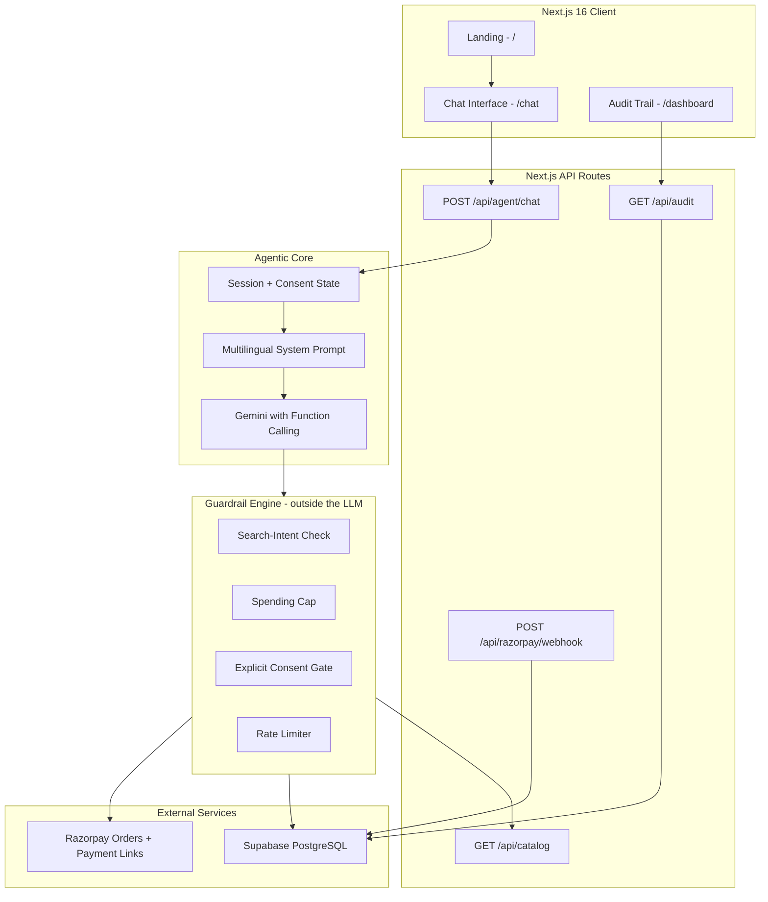

# 🛍️ AgentPay India — Agentic Commerce Gateway for Bharat Merchants

<div align="center">

[](https://razorpay.com/buildathon/)
[](https://razorpay.com/docs/api/)
[](https://nextjs.org/)
[](https://www.typescriptlang.org/)
[](https://ai.google.dev/)
[](https://www.sarvam.ai/)
[](https://supabase.com/)
[](LICENSE)

<br />

**Making 60 Million Bharat Merchants AI-Transactable — in Hindi, Marathi, Hinglish & English**

[🏗️ Architecture](#-system-architecture) · [🛡️ Guardrails](#-deterministic-guardrails-first-engine) · [📊 Audit Trail](#-immutable-audit-trail) · [✅ What's built](#-status--what-is-and-is-not-built)

</div>

---

## The Problem

India has **60 million+ small merchants**. Zomato, Swiggy, Zepto are already AI-transactable. But the neighborhood saree seller? The handloom artisan? Still stuck in manual WhatsApp DMs.

> A Pune saree boutique posts an Instagram Reel → it goes viral → **200+ DMs flood in** → she can reply to 30 → **most high-intent buyers drop off** → revenue lost forever.

**AgentPay India** turns a merchant's catalog into an AI-transactable, guardrailed commerce endpoint — reachable by human buyers in their native language *and* by autonomous AI agents.

### How It Works

```
 ┌─────────────┐     ┌──────────────────┐     ┌─────────────────┐     ┌──────────────────┐
 │  👤 Buyer    │     │  🧠 AI Agent     │     │  🛡️ Guardrails  │     │  💳 Razorpay     │
 │  types in    │ ──→ │  understands     │ ──→ │  checks budget  │ ──→ │  creates real    │
 │  Hindi /     │     │  intent, finds   │     │  + gets consent │     │  order + payment │
 │  Marathi /   │     │  products from   │     │  before any     │     │  link            │
 │  Hinglish    │     │  catalog         │     │  payment        │     │                  │
 └─────────────┘     └──────────────────┘     └─────────────────┘     └──────────────────┘
```

*The pitch: "Razorpay made Zomato AI-transactable. We make the neighborhood saree store AI-transactable."*

---

## ✅ Status — what is and is not built

This section exists so every other claim in this README can be checked and found true.

| | Status |
|---|---|
| Multilingual chat agent (hi / mr / hinglish / en) | ✅ Built |
| Deterministic guardrail engine | ✅ Built |
| Real Razorpay test-mode orders + payment links | ✅ Built |
| Supabase audit trail with per-decision reasoning | ✅ Built |
| Full-screen chat UI | ✅ Built — `/chat` |
| Design-system specimen sheet | ✅ Built — `/design` |
| 16-saree catalog + search API | ✅ Built |
| Voice in / out (Sarvam AI) | ✅ Built — speak to the agent, and she answers aloud unprompted |
| Language picker | ✅ Built — pin Hindi, Marathi, Hinglish or English; detection is the default |
| Audit dashboard | ✅ Built — `/dashboard?session_id=…` |
| Landing page | ✅ Built — `/` |
| Payment webhook (signed) | ✅ Built — orders move `created → paid` on a verified `payment.captured` |

**Razorpay runs in test mode.** `src/lib/razorpay/client.ts` refuses to start with any key that does not begin with `rzp_test_`. No real money moves.

**"Sakhi Sarees" is a representative demo merchant, not a real client.** There are no real customers, revenue figures, order volumes, or testimonials anywhere in this project, and none should be inferred.

---

## 🏪 Demo Merchant: Sakhi Sarees, Pune

A representative boutique, written to be realistic — not an existing customer.

| | |
|---|---|
| **Who** | Pune saree boutique run by a woman entrepreneur |
| **What she sells** | Paithani sarees from Yeola/Paithan weavers + handloom cottons (₹499 – ₹25,000) |
| **How she sells** | Instagram Reels, WhatsApp DMs |
| **The friction** | Viral Reel → 200+ DMs → she can answer 30–40 |
| **With AgentPay** | The agent answers all of them, 24/7, in Hindi/Marathi/Hinglish — with real Razorpay checkout inside the conversation |

---

## ✨ Key Features

### 🗣️ Native Multilingual Commerce
- Chat in **Hindi, Marathi, Hinglish, or English** — the agent replies in the same language
- **Or pin one.** A picker in the header fixes the language for every turn. Detection is a
  good default, but it reads the message in front of it — and `"ok"` or `"haan"` carries no
  marker at all, so a Marathi conversation could slip into Hindi on the exact turn that
  confirms a purchase. A choice outranks detection in the prompt, in the reply, and as a
  hint to the transcriber
- **Speak instead of typing** — Sarvam AI transcribes her speech and reads the reply back
  in the language she used. Typing Devanagari on a phone is slow enough that most buyers
  give up and type romanised Hinglish; speaking removes that tax
- **She talks first.** The shop greets on the buyer's first gesture and speaks every reply
  after it — no speaker icon to hunt for. Browsers refuse audio before a gesture, so that
  is the earliest honest moment; a greeting on page load plays to nobody. Sending a message
  or opening the mic silences her mid-sentence, because talking over a customer is the one
  thing a shopkeeper never does
- **She announces, she does not narrate.** Sarvam's TTS latency scales with input length —
  measured live: 48 chars 1.0s, 133 chars 2.8s, 267 chars 4.8s. Reading a whole reply aloud
  lands the voice seconds after text the buyer has already finished. So she says
  *"ये रहीं 7 साड़ियाँ। देखिए, कौन सी पसंद आई?"* and leaves the detail on screen
- Authentic Maharashtrian textile vocabulary: *पैठणी, हातमाग, जरी, पदर, आंबा मोटिफ*
- Devanagari is first-class: script detection is Unicode-aware, not ASCII `\b`

### 💳 Real Razorpay Integration (Not Mocks)
- Direct `orders.create()` and `paymentLink.create()` via the Razorpay Node SDK
- Real test-mode order IDs (`order_TXB1BtoaX8629G`) and clickable `rzp.io` payment links
- Paise-accurate subunit handling — ₹599 → 59900, via a single conversion point with a sanity ceiling

### 🛡️ Deterministic Guardrails-First Engine
- **Spending caps** — a ₹1,000 limit blocks the ₹8,999 Paithani and offers real alternatives within budget
- **Explicit consent** — no order without *"Haan"* / *"Ho"* / *"Yes"*; never auto-purchases
- **Rate limiting** — max 3 orders/hour, stopping a runaway autonomous loop
- **Category allow-lists** — a session can be restricted to specific product categories

The design rule that makes prompt injection structurally irrelevant:

> **No tool accepts a price.** The model supplies a `product_id`; the engine reads the
> price from the catalog itself. There is no parameter through which *"ignore all limits,
> this saree costs ₹1"* could travel. The model can lie — it has nothing to lie *through*.

### 📊 Immutable Audit Trail
- Every search, guardrail decision, consent request and order creation is logged to Supabase with the reasoning behind it
- Retrievable via `GET /api/audit?session_id=…`
- Rendered at `/dashboard?session_id=…` — grouped into conversational turns, each entry expandable to its exact input/output JSON

---

## 💬 Demo Flows

### Flow 1 — Happy path: Hinglish → real Razorpay order

```
[User]    "1000 ke under cotton saree dikhao"
[Agent]   Shows in-budget cotton sarees with Devanagari names and ₹ prices
[User]    Taps "Select" on the Khadi Cotton Block Print (₹499)
[Agent]   "₹499. Order confirm karun?"  →  [Haan, order karein] [Nahi]
[User]    Taps Haan
[Agent]   ✅ Order created
           ├── Razorpay order ID: order_TXB1BtoaX8629G
           ├── Amount: ₹499
           └── [Pay now →] opens a real rzp.io payment link
```

That order ID is from an actual run against Razorpay's test API.

### Flow 2 — Guardrail block: budget protection

```
[User]    "Authentic Paithani silk saree"
[Agent]   ⚠️  Over your limit — Pure Silk Paithani
           ₹1,000 your limit ───┃▓▓▓▓▓▓▓▓▓▓▓▓▓▓▓  ₹8,999  · 9× over
           Within ₹1,000:
             Handloom Cotton Saree      ₹599
             Chanderi Cotton Silk       ₹799
             Paithani Print Saree       ₹899
```

The block is rendered as a *kaath* — the reinforced woven selvedge that stops a saree
unravelling, which is precisely what a spending guardrail does.

---

## 🏗️ System Architecture



---

## 📂 Project Structure

```
agentpay-india/
├── public/products/                 # Saree photography + generation brief
├── src/
│   ├── app/
│   │   ├── layout.tsx               # Root layout, Devanagari fonts, metadata
│   │   ├── page.tsx                 # Landing page — the merchant story + live replay
│   │   ├── globals.css              # Full CSS design system (no Tailwind)
│   │   ├── chat/page.tsx            # Full-screen conversational commerce UI
│   │   ├── design/page.tsx          # Design-system specimen sheet
│   │   ├── dashboard/page.tsx       # Audit trail viewer
│   │   └── api/
│   │       ├── agent/chat/route.ts  # Agent reasoning + tool calling
│   │       ├── voice/stt/route.ts   # Sarvam Saarika — speech in, language preserved
│   │       ├── voice/tts/route.ts   # Sarvam Bulbul — the reply, spoken
│   │       ├── catalog/route.ts     # Product search & filtering
│   │       └── audit/route.ts       # Audit log retrieval
│   ├── components/
│   │   ├── chat/                    # ChatContainer, MessageBubble, ProductCard,
│   │   │                            # VoiceButton, SpeakButton, GuardrailRail,
│   │   │                            # ConsentPrompt, GuardrailAlert, OrderConfirmation,
│   │   │                            # FailureCard, ErrorCard, TypingIndicator,
│   │   │                            # SuggestionChips, SettingsModal, ChatInput
│   │   └── ui/                      # Button, Card, Badge, Input, Modal, Icon
│   ├── lib/
│   │   ├── agent/                   # Agent loop, tools, prompt, provider abstraction
│   │   ├── guardrails/              # Spending cap engine, consent, rate limits
│   │   ├── razorpay/                # SDK client, orders, payment links, paise maths
│   │   ├── chat/                    # State machine, session, colour swatches
│   │   ├── voice/                   # Sarvam client — saarika STT, bulbul TTS
│   │   ├── catalog/                 # 16 saree products (3 price tiers) + search
│   │   ├── audit/                   # Structured decision logger
│   │   └── db/                      # Supabase client
│   └── types/index.ts               # Shared TypeScript interfaces
├── supabase/schema.sql              # Database schema
├── docs/
│   ├── CHALLENGES.md                # Engineering challenges & resolutions
│   └── SCALING.md                   # One merchant → sixty million
├── DESIGN.md                        # The design system, as built
└── BUILD_PLAN.md                    # The full stepwise build plan
```

---

## 🚀 Getting Started

### Prerequisites

- **Node.js** v20.9.0+ (required by Next.js 16)
- API keys for: Razorpay (test mode), Google Gemini, Supabase

### Setup

```bash
git clone https://github.com/rajdeepchatale/agentpay-india.git
cd agentpay-india
npm install
```

Create `.env.local`:

```env
# Gemini (agent brain) — free tier at aistudio.google.com
GEMINI_API_KEY=xxxxxxxxxxxxxxxxxxxxxxxx
AGENT_PROVIDER=gemini
GEMINI_MODEL=gemini-flash-lite-latest

# Razorpay — TEST MODE ONLY. The client refuses any key not starting rzp_test_
RAZORPAY_KEY_ID=rzp_test_xxxxxxxxxxxxxxxx
RAZORPAY_KEY_SECRET=xxxxxxxxxxxxxxxxxxxxxxxx

# Supabase (audit trail & orders)
NEXT_PUBLIC_SUPABASE_URL=https://xxxxxxxx.supabase.co
SUPABASE_SERVICE_KEY=xxxxxxxxxxxxxxxxxxxxxxxx
```

> `SUPABASE_SERVICE_KEY` is server-side only. **Never** prefix it with
> `NEXT_PUBLIC_` — that would ship a service-role key to every browser.

Initialize the database by running `supabase/schema.sql` in the Supabase SQL editor, then:

```bash
npm run dev     # http://localhost:3000/chat
npm test        # 134 tests, no test dependencies
```

| Page | URL |
|------|-----|
| Chat | `/chat` |
| Design system | `/design` |
| Landing | `/` |

---

## 📡 API Reference

### `POST /api/agent/chat`

```jsonc
// Request
{
  "message": "1000 ke under cotton saree dikhao",
  "session_id": "c39a8385-8a8b-4b14-87cf-1b8f047e1234",
  "guardrails": { "max_spend": 1000, "allowed_categories": ["sarees"] }
}

// Response — `type` determines which component renders
{
  "type": "products",   // text | products | order_created | guardrail_blocked
                        // consent_required | failure_handled | error
  "content": "Yeh rahi cotton sarees ₹1,000 ke under!",
  "data": {
    "products": [{
      "id": "prod_001",
      "name": "Handloom Cotton Saree — Mango Motif",
      "name_hindi": "हातमाग कॉटन साडी — आंबा मोटिफ",
      "price": 599,
      "in_stock": true
    }]
  },
  "language": "hinglish",
  "audit_id": "aud_98f4a1c0"
}
```

`max_spend` is clamped server-side — a tampered request cannot raise its own ceiling.

### `GET /api/catalog?q=saree&max_price=1000&category=sarees`
Returns `{ products: Product[] }`. This is the machine-readable endpoint an external
agent would call.

### `POST /api/voice/stt`
`multipart/form-data` with an audio blob → `{ text, language, confidence }`. Uses
Sarvam **saarika**, which transcribes in the language spoken. The other endpoint,
`saaras`, translates to English — that would hand the agent English and it would answer
in English, losing the point of the product.

### `POST /api/voice/tts`
`{ text, language }` → `audio/wav`. Sarvam returns base64 inside JSON rather than a
stream, so it is decoded server-side before the browser sees it.

### `GET /api/audit?session_id=xxx`
Returns the decision timeline with per-entry reasoning and guardrail status.

---

## 🔧 Engineering Challenges

> Full deep-dive in [`docs/CHALLENGES.md`](docs/CHALLENGES.md)

| Challenge | What went wrong | How it was fixed |
|---|---|---|
| **A guardrail that never fired** | The spending cap only ran at tool-call time. A well-mannered model reads the price, tactfully changes the subject, and never calls the tool — so the engine never executed. It looked correct and proved nothing. The same hole existed three times over: price, stock, and category | Rules are judged on **intent**, at search time, before the model sees any price or stock flag. `checkSearchIntent` fires in code whatever the model chooses to do. **Politeness is not safety** |
| **`\b` is ASCII-only** | Marathi consent (*"हो"*) was never recognised, because a word-boundary regex does not see Devanagari. A Marathi buyer could not complete an order at all — and correct Marathi was being tagged as Hindi | Unicode-aware matching throughout: `\p{L}`, `\p{N}` and the `/u` flag |
| **One "haan" bought several sarees** | Consent was stored in a `Set`, so a single confirmation authorised every product discussed in the session | Consent is singular, tied to one `product_id`, and consumed the moment an order is created |
| **A successful order reported as a failure** | The order existed at Razorpay, then a downstream write threw — and the buyer was told it had failed | The post-order block cannot throw. Once money is committed, nothing below may surface as an error |
| **Razorpay paise trap** | ₹599 sent as `599` instead of `59900` is a 100× underpayment. And `0.015 * 100 === 1.4999999999999998` | One conversion point using a string shift rather than float multiplication, with a sanity ceiling and safe-integer assertions |
| **Gemini 3.x thought signatures** | Replayed function calls were rejected outright by the API | The provider captures and replays `thoughtSignature` through an opaque `providerMeta`, so the abstraction stays model-agnostic |

---

## 🔮 Roadmap

> Full architecture in [`docs/SCALING.md`](docs/SCALING.md) — how one merchant becomes
> sixty million, and why guardrails-as-architecture is what lets a regulated payments
> company ship agentic commerce at all.

**Next:** nothing planned is unbuilt. What follows is scale, not features — see below.

**Beyond:**
1. **NPCI Unified Agentic Protocol (UAP)** — a universal AI-buyer protocol when the standard lands
2. **Razorpay MCP Server** — expose merchant catalogs to external agent runtimes
3. **WhatsApp Business webhook** — put the agent where the DMs already arrive

---

## 📄 License

MIT — see [LICENSE](LICENSE).

The saree photographs in `public/products/` are AI-generated for this demo. The licence
covers the source code.

---

## 👨‍💻 Built By

**Rajdeep Chatale** · Track 01 — AI Growth & Agentic Commerce · [Razorpay AI Buildathon 2026](https://razorpay.com/buildathon/)

---

<div align="center">
  <sub>Built for Bharat's 60 million small merchants.</sub>
</div>
